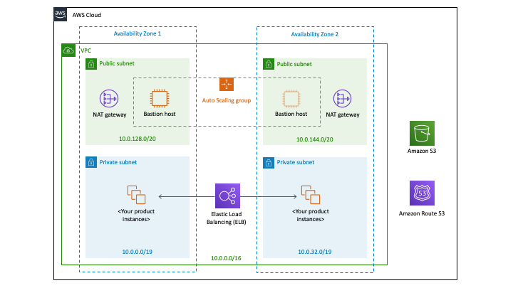

Deploying this Quick Start for a new virtual private cloud (VPC) with
*default parameters* builds the following <software> environment in the
AWS Cloud.

Figure 1: Quick Start architecture for <software> on AWS

As shown in Figure 1, the Quick Start sets up the following:

* A highly available architecture that spans two Availability Zones.*
* A VPC configured with public and private subnets, according to AWS
best practices, to provide you with your own virtual network on AWS.*
* In the public subnets:

* Managed network address translation (NAT) gateways to allow outbound
internet access for resources in the private subnets.*
* A Linux bastion host in an Auto Scaling group to allow inbound Secure
Shell (SSH) access to EC2 instances in public and private subnets.*

* In the private subnets:

* <describe any additional components>.

*** The template that deploys the Quick Start into an existing VPC skips
the components marked by asterisks and prompts you for your existing VPC
configuration.

== Planning the deployment

=== Specialized knowledge

